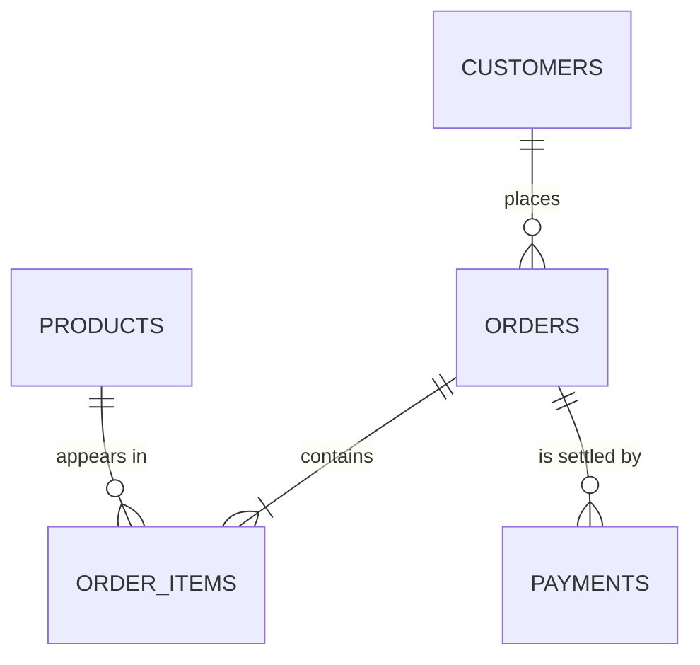

# Sales & Order Management Analytics System

A relational database and analytical SQL project for a retail / e-commerce
business. It covers the full path from business requirements through data
modelling, DDL, seed data, CRUD, joins, aggregation, window functions, views,
indexing and query optimisation, ending in a written set of business findings.

Built against the brief in `Data Analytics_Project_Sales_Order_Analytics.pdf`.

**Dialect:** PostgreSQL 13+
**Tested on:** DuckDB 1.5 (see [Why DuckDB](#why-the-scripts-are-tested-on-duckdb))
**Status:** 201 SQL statements execute end to end with zero failures.

---

## Quick start

```bash
pip install duckdb pandas
python tools/run_project.py
```

That builds the database, runs every script in order, and writes the results to
`output/`. It takes a couple of seconds.

To run on a real PostgreSQL server instead:

```bash
createdb sales_analytics
psql -d sales_analytics -f sql/01_schema.sql
psql -d sales_analytics -f sql/02_seed_data.sql
# ... 03 through 09 in order ...
psql -d sales_analytics -f sql/10_postgres_extensions.sql
```

---

## What's in here

```
sql/
  01_schema.sql               tables, keys, CHECK / UNIQUE / NOT NULL constraints
  02_seed_data.sql            generated sample data (do not edit by hand)
  03_crud_operations.sql      INSERT / SELECT / UPDATE / DELETE, transactions, integrity checks
  04_joins.sql                inner, left, full outer, anti, self and cross joins
  05_aggregate_analytics.sql  COUNT / SUM / AVG / MIN / MAX, GROUP BY, HAVING, GROUPING SETS
  06_advanced_analytics.sql   CTEs, subqueries, CASE, window functions, RFM, cohorts
  07_views.sql                the reusable reporting layer
  08_indexes_optimization.sql indexing strategy, EXPLAIN plans, slow/fast query rewrites
  09_business_reports.sql     the finished report pack, built on the views
  10_postgres_extensions.sql  triggers, stored procedures, materialised views, partitioning, SCD2

docs/
  data_model.md               ER diagram, cardinality, normalisation, data dictionary, index strategy
  insights_report.md          the business findings, with the numbers behind them

tools/
  generate_seed_data.py       regenerates 02_seed_data.sql (fixed random seed)
  run_project.py              executes every script and exports the results

output/                       produced by run_project.py
  report_pack.md              every report rendered as a markdown table
  r01..r13_*.csv              one CSV per report
  run_log.txt                 per-statement execution log
  sales_analytics.duckdb      the built database
```

Scripts must be run in numerical order. `03` is self-cleaning - it creates
everything it needs in the 9000 id range and removes it again - so the analytics
files after it always see the original seed data.

---

## The data model

Five tables: `customers`, `products`, `orders`, `order_items`, `payments`.



Three design decisions worth calling out, all explained in full in
[`docs/data_model.md`](https://github.com/aadishs-364/Project_1/blob/main/docs/data_model.md):

- **`orders.total_amount` is denormalised on purpose.** It is what the customer
  was actually charged and must survive a later catalogue re-price. The
  `header_vs_lines` check in `03` and the refresh trigger in `10` keep it from
  drifting.
- **`order_items.unit_price` is a price snapshot**, not a lookup into
  `products`. Re-pricing the catalogue must not silently rewrite history.
- **`payments` is one-to-many with `orders`, not one-to-one.** A failed attempt
  followed by a retry, or a sale followed by a refund, both need more than one
  row. `v_order_summary.payment_state` collapses them into a single verdict.

## The dataset

Simulated, with a fixed random seed, so every number in the docs is
reproducible. Regenerate with `python tools/generate_seed_data.py`.

| Table | Rows |
| --- | --- |
| customers | 120 |
| products | 43 |
| orders | 1,391 |
| order_items | 2,981 |
| payments | 1,586 |

Order window: January 2024 to August 2026.

The product catalogue and customer list are written by hand; the transactions
are simulated with deliberate structure in them - year-on-year growth, an
October festive peak, a Pareto revenue distribution, a core of repeat buyers
next to a tail of one-time ones, plus cancellations, returns, failed payments
and refunds. It also includes customers who never buy and products that never
sell, so the anti-join reports have something to find.

---

## Selected findings

Full write-up in [`docs/insights_report.md`](https://github.com/aadishs-364/Project_1/blob/main/docs/insights_report.md).

- **Volume is growing but the average order is shrinking.** Like-for-like
  January-August, orders are up 47.6% over two years while revenue is up only
  17.2%. Average order value has fallen 20.6%.
- **Six active products are out of stock**, including the number one and number
  four products by revenue. Together they represent 27.5% of historical
  revenue, with nothing on the shelf.
- **Discounting is buying nothing.** Units per order line are flat at ~1.5
  across every discount band, while margin falls from 43.9% to 33.3%. 4,79,826
  of margin was given away for no measurable lift.
- **91.4% of revenue comes from repeat buyers**, and 26 customers produce 55.8%
  of it. Seven high-value customers have gone quiet.
- **Electronics is 56% of revenue at the worst margin in the catalogue** (34.7%
  against 60.6% for Books).

---

## SQL techniques demonstrated

| Area | Where |
| --- | --- |
| DDL, primary/foreign keys, CHECK / UNIQUE / NOT NULL | `01` |
| INSERT / SELECT / UPDATE / DELETE, transactions, ROLLBACK, integrity checks | `03` |
| INNER, LEFT, FULL OUTER, anti, self and cross joins | `04` |
| COUNT / SUM / AVG / MIN / MAX, GROUP BY, HAVING, FILTER, GROUPING SETS | `05` |
| CTEs, correlated and scalar subqueries, EXISTS, CASE | `04`, `06` |
| RANK, DENSE_RANK, ROW_NUMBER, NTILE, PERCENT_RANK, LAG, moving averages, running totals | `06` |
| Month-over-month and year-over-year growth, Pareto, cohort retention, RFM segmentation | `06` |
| Views as a reusable semantic layer | `07` |
| Index design, composite index column order, EXPLAIN, sargability, query rewrites | `08` |
| Triggers and audit history, stored procedures, functions, materialised views, partitioning, SCD Type 2 | `10` |

---

## Why the scripts are tested on DuckDB

The target dialect is PostgreSQL, but there is no PostgreSQL server on the
machine this was built on. DuckDB speaks a close-enough PostgreSQL dialect that
`01` through `09` run on it unmodified, which means the SQL in this repository
is *executed and verified*, not just written and hoped for.

The two places the dialects genuinely part ways are handled explicitly:

- Materialised views, savepoints and PL/pgSQL are kept out of `01`-`09`
  entirely and live in `10_postgres_extensions.sql`, which the runner skips.
  That file is PostgreSQL-only and has not been executed.
- DuckDB cannot delete a parent row in the same transaction that removed its
  children, so the cleanup block in `03` commits the child deletes first. The
  reason is noted in a comment at that point in the file. On PostgreSQL all
  four deletes belong in one transaction.

`EXPLAIN` output naturally differs between the two engines. On PostgreSQL, use
`EXPLAIN (ANALYZE, BUFFERS)` to get real timings and page counts.

---

## Verification

`tools/run_project.py` reports a pass/fail count per statement and writes
`output/run_log.txt`. Current state: 201 statements, 0 failures, no report
returning an empty result.

Beyond "it ran", `03_crud_operations.sql` ends with four integrity assertions
that must all report `bad_rows = 0`:

- no orphaned `order_items`
- no `payments` pointing at a missing order
- no order header disagreeing with the sum of its own lines
- no order with zero lines
