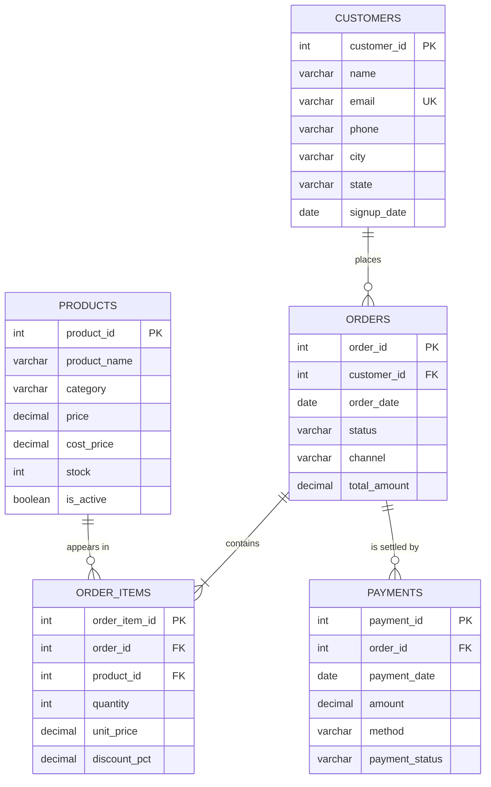

# Data Model

## Entity relationship diagram

## Relationships and cardinality

| Relationship | Cardinality | Notes |
| --- | --- | --- |
| customers -> orders | 1 to many (optional) | A customer may exist without ever ordering. 13 of the 120 seeded customers never do, which is what the "never purchased" report is for. |
| orders -> order_items | 1 to many (mandatory) | An order with no lines is invalid. The integrity checks in `03_crud_operations.sql` assert this stays true. |
| products -> order_items | 1 to many (optional) | A product may never have been sold. |
| orders -> payments | 1 to many (optional) | Deliberately **not** one-to-one. A failed attempt followed by a retry, or a payment followed by a refund, both produce more than one row for the same order. Cancelled orders may have no payment row at all. |

`order_items` is the associative (junction) table resolving the many-to-many
between `orders` and `products`, with `quantity`, `unit_price` and
`discount_pct` as relationship attributes.

## Normalisation

The model is in third normal form, with one deliberate exception.

- **1NF** - every column is atomic; repeated products in an order become
  separate `order_items` rows rather than a list.
- **2NF** - no partial dependencies. `unit_price` belongs on `order_items`
  because it depends on the whole order line (which product, in which order),
  not on the product alone.
- **3NF** - no transitive dependencies. `category` sits on `products`, not on
  `order_items`; `city` and `state` sit on `customers`, not on `orders`.

**The exception:** `orders.total_amount` is derivable from `order_items` and so
is technically redundant. It is kept because:

1. it is the amount the customer was actually charged, and must not change if
   the catalogue is re-priced later;
2. almost every report aggregates order totals, and reading one stored column
   is far cheaper than re-aggregating the line table every time.

The cost of that choice is that the column can drift. Two things guard it: the
`header_vs_lines` integrity check in `03_crud_operations.sql`, and the
`order_items_refresh_total` trigger in `10_postgres_extensions.sql`.

## Data dictionary

### customers

| Column | Type | Constraints | Description |
| --- | --- | --- | --- |
| customer_id | INTEGER | PK | Surrogate identifier. |
| name | VARCHAR(100) | NOT NULL | Full name as registered. |
| email | VARCHAR(150) | NOT NULL, UNIQUE, CHECK `LIKE '%@%.%'` | Natural key. The CHECK is a cheap shape test, not real validation. |
| phone | VARCHAR(20) | nullable | Contact number; genuinely optional. |
| city | VARCHAR(80) | NOT NULL | Used for the geography report. |
| state | VARCHAR(80) | NOT NULL | Roll-up level above city. |
| signup_date | DATE | NOT NULL, CHECK `>= 2020-01-01` | Registration date, the basis for the acquisition cohort. |

### products

| Column | Type | Constraints | Description |
| --- | --- | --- | --- |
| product_id | INTEGER | PK | Surrogate identifier. |
| product_name | VARCHAR(150) | NOT NULL | Display name. |
| category | VARCHAR(60) | NOT NULL | Six categories in the seed data. |
| price | DECIMAL(12,2) | NOT NULL, CHECK `> 0` | Current list price. |
| cost_price | DECIMAL(12,2) | NOT NULL, CHECK `>= 0`, CHECK `<= price` | Landed cost; makes margin reporting possible without a costing table. |
| stock | INTEGER | NOT NULL, CHECK `>= 0`, default 0 | Units on hand. |
| is_active | BOOLEAN | NOT NULL, default TRUE | Soft delete. Delisted products keep their sales history. |

### orders

| Column | Type | Constraints | Description |
| --- | --- | --- | --- |
| order_id | INTEGER | PK | Surrogate identifier. |
| customer_id | INTEGER | NOT NULL, FK -> customers | Buyer. |
| order_date | DATE | NOT NULL | Date the order was placed. |
| status | VARCHAR(20) | NOT NULL, CHECK in list | `PLACED`, `SHIPPED`, `COMPLETED`, `CANCELLED`, `RETURNED`. |
| channel | VARCHAR(20) | NOT NULL, CHECK in list | `WEB`, `MOBILE_APP`, `STORE`, `MARKETPLACE`. |
| total_amount | DECIMAL(12,2) | NOT NULL, CHECK `>= 0` | Stored roll-up of the lines. See the normalisation note above. |

### order_items

| Column | Type | Constraints | Description |
| --- | --- | --- | --- |
| order_item_id | INTEGER | PK | Surrogate identifier. |
| order_id | INTEGER | NOT NULL, FK -> orders | Parent order. |
| product_id | INTEGER | NOT NULL, FK -> products | Product sold. |
| quantity | INTEGER | NOT NULL, CHECK `> 0` | Units on this line. |
| unit_price | DECIMAL(12,2) | NOT NULL, CHECK `>= 0` | Price snapshot at the time of sale, not a lookup into `products`. |
| discount_pct | DECIMAL(5,4) | NOT NULL, CHECK `>= 0 AND < 1`, default 0 | Line discount as a fraction. 0.15 means 15%. |
|  |  | UNIQUE (order_id, product_id) | A product appears at most once per order. |

Line revenue is always `quantity * unit_price * (1 - discount_pct)`. That
formula is written once in `v_order_lines` and reused everywhere else.

### payments

| Column | Type | Constraints | Description |
| --- | --- | --- | --- |
| payment_id | INTEGER | PK | Surrogate identifier. |
| order_id | INTEGER | NOT NULL, FK -> orders | Order being settled. Not unique on purpose. |
| payment_date | DATE | NOT NULL | Settlement date, which can be later than `order_date`. |
| amount | DECIMAL(12,2) | NOT NULL, CHECK `>= 0` | Amount of this attempt. |
| method | VARCHAR(30) | NOT NULL, CHECK in list | `UPI`, `CREDIT_CARD`, `DEBIT_CARD`, `NET_BANKING`, `WALLET`, `COD`. |
| payment_status | VARCHAR(20) | NOT NULL, CHECK in list | `PAID`, `PENDING`, `FAILED`, `REFUNDED`. |

Net cash for an order is `SUM(amount WHERE PAID) - SUM(amount WHERE REFUNDED)`.
`v_order_summary.payment_state` collapses the several payment rows an order can
have into a single verdict.

## Reporting views

| View | Grain | Purpose |
| --- | --- | --- |
| `v_order_lines` | one order line | Base fact view. Resolves customer, product, and the derived money columns (`line_revenue`, `line_cost`, `line_profit`, `line_discount`). |
| `v_order_summary` | one order | Order header enriched with line counts, cost, gross profit and a resolved `payment_state`. |
| `v_monthly_revenue` | one month | Trend line with running total and month-over-month growth. |
| `v_product_performance` | one product | Catalogue scorecard. LEFT JOINed so unsold products show as zero rather than disappearing. |
| `v_customer_value` | one customer | CRM view including customers who never bought. |
| `v_payment_reconciliation` | one month | Booked order value against cash actually collected. |

## Index strategy

| Index | Columns | Why |
| --- | --- | --- |
| `idx_orders_customer` | orders(customer_id) | Foreign keys are not indexed automatically; this one is joined on in nearly every customer report. |
| `idx_orders_date` | orders(order_date) | Range scans for every trend report. |
| `idx_orders_status_date` | orders(status, order_date) | The dominant access pattern, "COMPLETED orders in a date window". Equality column first, range column second - reversing them would prevent the range from being used. |
| `idx_items_order` | order_items(order_id) | Every basket and line-level query joins on it. |
| `idx_items_product` | order_items(product_id) | Every product report joins on it. |
| `idx_payments_order` | payments(order_id) | Reconciliation join. |
| `idx_payments_status_date` | payments(payment_status, payment_date) | Settlement scans. |
| `idx_customers_city` | customers(city) | Geography grouping. |
| `idx_products_category` | products(category) | Catalogue grouping. |

Primary keys already provide a unique index on every `*_id`, so those are not
duplicated.
